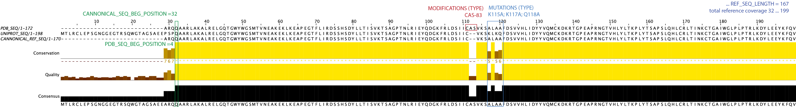

# Overview
CoDIAC uses three key databases (Uniprot, Interpro, PDB) in the following steps:
1. Interpro: We use Interpro to fetch all Uniprot accessions that have an Interpro ID in a given species. 
```uniprot_IDs, species_dict = CoDIAC.InterPro.fetch_uniprotids(Interpro_ID, REVIEWED=True, species='Homo sapiens')```
Where Reviewed can be False (returning all protein records). Species names are the same as defined by Uniprot (search [Uniprot taxonomy to find the correct species name](https://www.uniprot.org/taxonomy?query=*)
2. Uniprot (**Uniprot Reference File**): Given a set of uniprot IDs, such as above ```uniprot_IDs```, we next define the human protein reference and information for all uniprot IDs. This reference generation also uses Interpro to determine domain boundaries. 
``` uniprot_df = CoDIAC.UniProt.makeRefFile(uniprot_IDs, uniprot_reference_file) ```
We will refer to uniprot_reference_file from here as the **Uniprot Reference File**. You may want to manually check that the domains included are of interest to your final analysis. You can generate the FASTA reference file of the domain of interest in the following way:
``` CoDIAC.UniProt.print_domain_fasta_file(uniprot_reference_file, Interpro_ID, fasta_long_header_file, n_term_offset=0, c_term_offset=0, APPEND=False) ```
This will produce a fasta reference file with a verbose fasta header (hence we print this to fasta_long_header_file)
To produce a reference file with a more manageable header (such as what promals3d will take without truncating the header)
``` key_array_order= ['uniprot', 'gene', 'domain_num', 'start', 'end'] ```
```CoDIAC.UniProt.translate_fasta_to_new_headers(fasta_long_header_file, fasta_file, key_array_order) ```
Which produces a final `fasta_file` we will use for alignment and mapping. 
3. PDB (**PDB Reference File**): The Uniprot Reference File includes a listing of structure accessions that exist for a protein. These structures may or may not cover the Interpro Domain of interest, but we next fetch all PDBs that are connected to a protein in the Uniprot Reference File
```CoDIAC.PDB.generateStructureRefFile_fromUniprotFile(uniprot_reference_file, PDB_file)```
This produces PDB_file, which we will refer to as the **PDB Reference File**.
4. PDB + Uniprot (**Integrated PDB Reference File**). Now, in order to map domains onto whether and where they appear in the PDB structures, we have to integrate information in the Uniprot Reference File with that of the PDB File
``` struct_df_out = CoDIAC.IntegrateStructure_Reference.add_reference_info_to_struct_file(PDB_file, uniprot_reference_file, PDB_file_annotated, INTERPRO=True, verbose=False)```
`INTERPRO=True` will use the Interpro domains, otherwise it will use the Uniprot domain boundaries when mapping. 
`PDB_file_annotated` is the output and we will refer to this as the **Integrated PDB Reference File**
5. Finally, we reduce the Integrated PDB Reference File to contain only structures that span completely the Interpro_ID of choice. 
```CoDIAC.IntegrateStructure_Reference.filter_structure_file(PDB_file_annotated, Interpro_ID, PDB_file_filtered)```
`PDB_file_filtered` is the main output and it is a subset of the **Integrated PDB Reference File** that will be of interest for further analysis. However, all the columns and information are the same as the parent file, so please refer to that section below. 


# File column definitions
## Uniprot Reference File (CSV file, comma-separated between columns)
* UniProt ID: The Uniprot accession ID for the protein
* Gene: gene name
* Species: Species, using Uniprot taxonomy
* Ref Sequence: Full protein sequence as defined by Uniprot - canonical sequence
* PDB IDs: semicolon separated list of PDB IDs 
* Uniprot Domains: These are domains and domain boundaries as defined by the Uniprot database. The semicolon separated domain list is defined as the following colon-separated details for each domain (name:domain start:domain end)
* Uniprot Domain Architecture: This is the architecture of the protein, defined by domains only and ordered in the same way as they appear in the protein from N- to C-terminal. Domains are separated by '|' 
* Interpro Domains: These are domains and domain boundaries as defined by the Interpro database. The semicolon separated domain list is defined as the following colon-separated details for each domain, just like Uniprot, but now an additional element to keep the InterproID (name:Interpro domain ID:domain start:domain end)
* Interpro Domain Architecture: This is the architecture of the protein, defined by domains of Interpro only and ordered in the same way as they appear in the protein from N- to C-terminal. Domains are separated by '|' 

## PDB Reference File (CSV file, comma-separated, columns all use capitalization)
This file contains a myriad of sequences, which arises from the fact that experimental structures typically can include purification or detection tags (non-native protein sequence), fractions of the protein of interest, and variants of proteins, compared to the current reference. Hence, we compile all of these as we setup to understand how an experimental structure captures information about the current uniprot sequences. 
* PDB_ID - PDB identifier of the structure
* ENTITY_ID - ID of the entity on that line (sometimes many entities to one structure)
* ENTITY_DESCRIPTION - A description of the polymer entity
* CHAIN_ID - Chain IDs associated with the polymer entity
* DATABASE - Reference database name (ACCESS column holds the accession number for the entity)
* GENE_NAME - Gene name associated with the entity
* ACCESS - Reference database accession code
* PDB_SEQ - Sequence of protein or nucleic acid polymer that corresponds with the entity
* UNIPROT_SEQ - Protein sequence data for canonical protein sequence (refers to the protein sequence found through UniProt)
* CHAIN_LENGTH - The monomer length of the sample sequence.
* POLYMER_TYPE - A coarse-grained polymer entity type.
* MACROMOLECULAR_TYPE - type of polymer
* MOLECULAR_WEIGHT - The molecular mass (KDa) of polymer and non-polymer entities (exclusive of solvent) in the deposited structure entry
* EXPERIMENT_TYPE - The category of experimental method(s) used to determine the structure entry.
* RESOLUTION - Combined estimates of experimental resolution contributing to the refined structural model.Resolution reported in "refine.ls_d_res_high" is used for X-RAY DIFFRACTION, FIBER DIFFRACTION, POWDER DIFFRACTION, ELECTRON CRYSTALLOGRAPHY, and NEUTRON DIFFRACTION as identified in "refine.pdbx_refine_id". Resolution reported in "em_3d_reconstruction.resolution" is used for ELECTRON MICROSCOPY. The best value corresponding to "em_3d_reconstruction.resolution_method" == "FSC 0.143 CUT-OFF" is used, if available. If not, the best "em_3d_reconstruction.resolution" value is used. For structures that are not obtained from diffraction-based methods, the resolution values in "refine.ls_d_res_high" are ignored. Multiple values are reported only if multiple methods are used in the structure determination.
* PDB_REF_SEQ - truncated part of UNIPROT_SEQ that aligns with the PDB entity’s sequence (aligned canonical sequence)
* PDB_SEQ_BEG_POSITION - points to the position in the entity sequence that aligns with the canonical sequence
* REF_SEQ_BEG_POSITION - points to the position in the canonical sequence that aligns with the entity sequence
* REF_SEQ_LENGTH - length of the aligned regions between the entity and canonical sequences
* SPECIES - Scientific name of the organism from which the gene originates
* MUTATIONS (Y/N) - Tells us if there are any mutations present in the entity sequence
* MUTATIONS (#) - Number of mutations present in the entity sequence
* MUTATIONS (LOCATION) - a semicolon-separated list of positions (in reference numbering) where variants exist in the structure sequence, relative to the reference sequence.
* MUTATIONS (TYPE) - a comma-separated list of mutations, where aa1POSaa2 indicates aa1 at POS is mutated to aa2. For example V314R, indicates V314 in reference is an R in structure.
* MODIFICATIONS (LOCATION)- a semicolon-separated list of positions (in structure-based numbering) where modifications (MODRES) exist in the structure sequence.
* MODIFICATIONS (TYPE) - a semicolon-separated list that includes the controlled PTM vocabulary of PDB and the position. For example `PTR-5` indicates phosphotyrosine at position 5 in the structure sequence. To find the meaning of a MODRES search: ```https://www.rcsb.org/ligand/PTR```, replace PTR with the code of interest. 
* DEPOSITED (DATE) - The date of initial deposition
* DEPOSITED (AUTHORS) - Names of authors of this data block
* TITLE - The title of this citation
* DOI - Document Object Identifier used by doi.org to uniquely specify bibliographic entry
* PUBMED_ID - the Pubmed ID for a paper of interest. 
### Summary and description of PDB sequences
* PDB_REF_SEQ is the sequence that was experimentally created, it has been corrected to remove the three letter code of a modification and it has variants that were experimentally used. This sequence will still include non-reference information, like tags or epitopes. In the PDB files, this whole sequence will start at position 1 and go to the end of the sequence. In order to access locations as they relate, you would use the following.
    * PDB_SEQ_BEG_POSITION (**PDB structure numbering**) - this is the position (ones-based counting) in the REF_SEQ and the PDB_SEQ where the reference sequences begins to be expressed. 
    * REF_SEQ_BEG_POSITION (**Reference numbering**)- this is the position in the reference sequence where the experimental position picks up. 
    * The end of the structure sequence that matches the reference can be found by PDB_SEQ_BEG_POSITION + REF_SEQ_LENGTH


## Integrated PDB Reference File
Given PDB structures and all the sequence information about them (**PDB Reference File**), we use the **Uniprot Reference File**, which defines domains of interest to annotate PDB experiments in order to find structures that include the domain of interest. Since the PDB file will contain additional proteins (e.g. ligands or complexes that do not have the domain of interest), these rows of the PDB file will not match information in the reference file. This will be denoted by N/A.
The columns that are integrated from the Uniprot reference, appended to the PDB Reference File to produce the Integrated PDB Reference File are:
* gene name - the gene name as defined in the Uniprot Reference. If this is a sequence not in the Reference file, this will state **N/A (Not Found In Reference)** If this occurs, the remaining fields will also state N/A.
* struct/ref sequence - this is the structure sequence experimentally made that spans just the Uniprot (integrated) reference. 
* reference range - this is the numbering in the structure sequence space of where the struct/ref sequence exists. 
* pos diff - number of total variants found between structure and reference.
* Gaps Ref:Struct - Number of insertions in the full range covering the reference that exist in strucutre that are not in reference
* Gaps Struct:Ref - Number of insertions in the full range covering the reference that exist in reference that are not in structure
* ref variants - this documents the variants in the structure sequence space. So if this column says A115K then in the structure sequence at position 115 there is an alanine that is a lysine in the reference (integrated) sequence.	
* domains - These are domains and domain boundaries (in the structure sequence numbering) from Interpro domain of the reference file. We use the same general structure as in the Uniprot reference (semicolon separation for lists of domains). However, here, at the end of the colon-separated details of domain name:Interpro domain ID is an information string that is comma-separated. This information includes the start position (structure-based numbering), end position (structure-based numbering), number of gaps (number of insertions that exist inside the domain region), number of variants (number of amino acids that differ between structure and reference within the domain region).
For example: `SH2:IPR000980:46,156,0,3;SOCS_box:IPR001496:151,197,0,0` for stucture 7M6T of uniprot reference O14508 indicates the structure spanned the SH2 domain and the SOCS_box and in the structure file the SH2 domain can be found starting at 46 and ends at 156 and there are 3 variants, no insertions (no variants, no insertions within the SOCS_box domain).
* struct domain architecture - This is an easily readable string of domain names, in the order they appear in the protein from N- to C-terminal that was covered by the experiment. Domains are separated by '|'. For example SH3_domain|SH2|Prot_kinase_dom means that the structure fully covered the SH3_domain, SH2, and Protein_kinase_dom of a SRC family kinase. 
* protein domain architecture - For easy reference, this includes the architecture of the full protein so it can be seen what part of the whole protein was studied in the experiment.